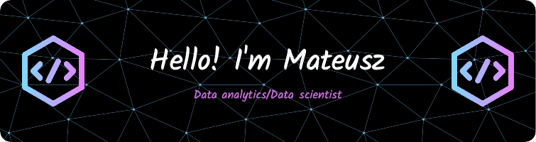

### I am a final-year **Data Science** student at **Politechnika Bydgoska**.    **What I do:** 👨‍🔬 Data collection, Data cleaning, and wrangling. 🔭 Exploratory Data Analysis (EDA) and statistical analysis. 📊 Building business dashboards. 🧠 I am actively learning **ML/AI**. 🤝 Currently looking for an **internship** in **Data Analytics / Data Science**.   **Additional Information** 🌍 I am currently based in **Poland**.  🗣️ I can speak  **4** languages (English,Poland,Germany,Russian). 📬 You can contact me at (Email,LinkedIn). 💡 Open to **new projects and opportunities**!   

## 🌐 Socials:
   

# 💻 Tech Stack:
             

 

## 🎯 Practice & Challenges  
🔹 **Hands-on practice on various platforms:**  

  
  

# 📊 GitHub Stats:
 
 

## 🏆 GitHub Trophies

### 🔝 Top Contributed Repo

---

<!-- Proudly created with GPRM ( https://gprm.itsvg.in ) -->
